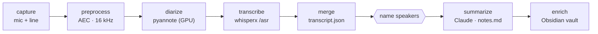

# Briefly

> Record a work meeting on a dedicated soundcard and get a clean, **speaker-attributed,
> per-person brief** in your Obsidian vault — transcribed and diarized on your own
> infrastructure, summarized by Claude.

[](https://github.com/nathanpaul/briefly/actions/workflows/tests.yml)


Briefly splits a meeting into two channels — **mic-in = you**, **line-in = the remote side**
(via a DAC line-out) — so "who said what" falls out of the hardware. Each stage reads a file and
writes a file, so any stage can be re-run in isolation and nothing proprietary leaves your
machines until Claude writes the summary.

**[▶ Run a meeting](docs/running-a-meeting.md)** · [Architecture](docs/architecture.md) ·
[Design notes (PLAN)](PLAN.md) · [Knowledge base](knowledge/) — *agents start at
[CLAUDE.md](CLAUDE.md)*

---

## Pipeline



**Diarize + transcribe run on a selectable [ASR backend](docs/asr-backends.md)** (`BRIEFLY_ASR_BACKEND`,
default **`whisperx`**) — always as **two separate steps**: WhisperX on the GPU box transcribes via
`/asr` and diarizes via its own `/diarize`; `faster-whisper` (cluster CPU) + pyannote; or legacy
`wyoming` (text-only, sliced by the diarization turns). Stage
outputs live in per-meeting dirs (`recordings/ → processed/ → transcripts/ → vault/`), keyed by a
ULID `meeting_id`; `briefly run` skips any stage whose output already exists.

## Quickstart

```sh
# on the capture laptop (macOS + ffmpeg)
pip install -e '.[aec,whisper,summarize]'
cp .env.example .env                        # point at your whisper + diarize services

# 1. CAPTURE — record the two soundcard channels (meeting length is open-ended)
briefly capture start --attendees "Jane Doe,John Smith"   # prints a meeting_id; records detached
#   … the meeting happens …
briefly capture stop                                       # finalizes recordings/<id>/

# 2. TRANSCRIBE — preprocess → diarize → transcribe → merge (defaults to the last capture)
briefly run                                                # → transcripts/<id>/transcript.{json,txt}

# 3. NAME the speakers in transcripts/<id>/speakers.json (merge picks the names up):
#   {"map": {"Me": "You", "Speaker_1": "Jane Doe", "Speaker_2": "John Smith"}}

# 4. SUMMARIZE + ENRICH into your Obsidian vault — choose one:
briefly run --from summarize --to enrich --force           # a) standard per-person brief, then enrich
briefly summarize "3-bullet exec summary + action items with owners; link each person to their MOC"
#                                                            b) custom: enrich THIS meeting your way
```

Every step defaults to the **last captured meeting** (via `recordings/.last-meeting-id`), so you rarely
pass `--meeting-id`; `briefly run` also auto-loads `.env` and skips any stage whose output already
exists. Step 4 gives you two ways to land notes in the vault: **(a)** the fixed pipeline — a structured
per-person brief (`summarize`) followed by vault-aware enrichment (`enrich`); or **(b)** `briefly
summarize "<prompt>"`, a one-shot agentic pass where your prompt decides how *this* meeting is written
into the vault. Every stage is also its own command (`briefly
{capture,preprocess,diarize,transcribe,merge,summarize,enrich}` — add `--help`). Full walkthrough with
audio-chain + gain guidance: **[docs/running-a-meeting.md](docs/running-a-meeting.md)**.

<details>
<summary><b>Or run it fully automatically (watch mode)</b></summary>

```sh
briefly watch                  # processes each new capture up to merge, then stops for naming
briefly watch --to enrich      # fully unattended (keeps Speaker_N labels until you rename + re-run)
```
The watcher is single-worker, resumable, and idempotent — it fires the moment capture finalizes a
meeting's `meeting.json`.
</details>

## Requirements

| | |
|---|---|
| **Capture** | macOS with the Cubilux CB5 soundcard; `ffmpeg` 8.x at `/opt/homebrew/bin/ffmpeg`. |
| **Runtime** | Python 3.11+. Core is **stdlib-only**; `pip install -e '.[aec,whisper,summarize]'` adds `numpy` (real AEC), `wyoming` (STT client), and `anthropic` (Claude). Without the extras, AEC passes through and transcribe/summarize are unavailable. (Or `pip install -r requirements.txt`.) |
| **Services** | A **wyoming-whisper** endpoint (Wyoming/TCP) and a **pyannote diarization** HTTP service — your [homelab](knowledge/cluster/homelab-services.md), or both in [local Docker](docs/local-docker-fallback.md) *(planned)*. |
| **Claude** | The `claude` CLI (your Claude Code auth) — `enrich` and `summarize` both use it by default, **no API key needed**. Set `ANTHROPIC_API_KEY` only to run `summarize` via the Anthropic SDK instead. |
| **Vault** | Copy [vault-template/](vault-template/) and set the `40-Personal` OS guard (see its README). |

## Configuration

`briefly run` / `briefly watch` auto-load a **`.env`** in the working directory (gitignored; copy
[`.env.example`](.env.example)). Real env vars and CLI flags override it.

| Key | Purpose |
|---|---|
| `BRIEFLY_DIARIZE_URL` | pyannote `POST /diarize` (HTTP) |
| `BRIEFLY_WHISPER_HOST` / `BRIEFLY_WHISPER_PORT` | wyoming-whisper (Wyoming/TCP — no HTTP route) |
| `BRIEFLY_VAULT_DIR` / `BRIEFLY_DATA_ROOT` | Obsidian vault + where `recordings/…` live |

A JSON config ([briefly.example.json](briefly.example.json), `--config`) works too.

## Services

Pick an [ASR backend](docs/asr-backends.md) with `BRIEFLY_ASR_BACKEND` (default `whisperx`):
- **`whisperx`** — one **GPU** box, two endpoints: transcribe + align via `/asr` → `BRIEFLY_WHISPERX_URL`, and diarize via its own `/diarize` → `BRIEFLY_DIARIZE_URL` (a drop-in for the pyannote service). Separate steps. Stand it up with [deploy/whisperx-gpu/](deploy/whisperx-gpu/).
- **`faster-whisper`** — CPU faster-whisper (word timestamps) on the cluster → `BRIEFLY_FASTER_WHISPER_URL`, plus the pyannote diarization service → `BRIEFLY_DIARIZE_URL`.
- **`wyoming`** — legacy `wyoming-whisper` (Wyoming/TCP, text-only) → `BRIEFLY_WHISPER_HOST`/`…_PORT`, plus pyannote.

Homelab specifics: [knowledge/cluster/homelab-services.md](knowledge/cluster/homelab-services.md).

## Testing

```sh
pip install -e '.[aec]'                          # numpy → the real AEC tests run (else skipped)
python3 -m unittest discover -s tests -t .
```

The suite is **fully offline** — whisper, diarization, and Claude are all faked — so it needs no
services and no Docker. [CI](.github/workflows/tests.yml) runs it on macOS (Python 3.11–3.13) on
every push and PR; the ffmpeg-backed capture/preprocess tests use synthetic `lavfi` sources.

## Status & roadmap

**Validated end-to-end on real hardware (2026-06-15):** CB5 capture → preprocess (AEC) → live
pyannote diarization → 3-replica wyoming-whisper transcription → merge → a correct
speaker-attributed transcript.

<details>
<summary><b>Before your first real meeting</b></summary>

- **Lower the mic preamp** so peaks sit −6…−12 dB (clipping is detected and warned).
- **Monitor on closed-back / IEMs** so the remote audio doesn't leak into the "Me" channel. AEC +
  merge de-dup handle direct leakage; room/speaker leakage is worse — see
  [knowledge/test-results/live-capture-2026-06-15.md](knowledge/test-results/live-capture-2026-06-15.md).
</details>

**Follow-ups:** local Docker fallback for the two services (planned) · audio-energy echo de-dup ·
capture aggregate-device mode + sync-marker offset · a launchd unit for `watch`.
