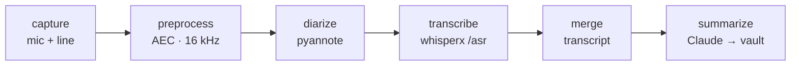

# Briefly

> Record a work meeting on a dedicated soundcard and get a clean, **speaker-attributed** note in
> your Obsidian vault — transcribed and diarized on your own GPU, summarized by Claude.

[](https://github.com/nathanpaul/briefly/actions/workflows/tests.yml)


Briefly splits a meeting into two channels — **mic-in = you**, **line-in = the remote side** (via a
DAC line-out) — so "who said what" falls out of the hardware. Each stage reads a file and writes a
file, so any stage re-runs in isolation, and nothing leaves your machines until Claude writes the note.

## Pipeline



`briefly process` runs **preprocess → diarize → transcribe → merge** (each stage is skipped if its
output already exists), then `briefly summarize` writes the meeting into your vault. Diarize and
transcribe are separate steps served by a selectable backend (`ASR_BACKEND`, default
**`whisperx`** — one GPU box that serves both `/asr` and `/diarize`). Outputs live in per-meeting
directories keyed by a short, sequential `meeting_id` — `meeting_0001`, `meeting_0002`, … (prefix
configurable via `MEETING_ID_PREFIX`).

## Quick start

**1 — Stand up the GPU service** (transcribe + diarize on CUDA — see [deploy/whisperx-gpu/](deploy/whisperx-gpu/)):
```sh
cd deploy/whisperx-gpu
cp .env.example .env            # paste your Hugging Face token (see "Hugging Face access" below)
docker compose up --build -d    # serves /asr + /diarize on :8000
```

**2 — Configure Briefly** (the capture machine):
```sh
pip install -e '.[aec,whisper]'
cp .env.example .env            # defaults already point at the service on localhost:8000
```

**3 — Record, process, and summarize a meeting:**
```sh
briefly capture start --attendees "Jane Doe,John Smith"   # records in the foreground; Ctrl-C to stop
#   … the meeting happens; a "…recording mm:ss" notice prints every 30s …
#   press Ctrl-C when done — it finalizes the recording
briefly process                                            # preprocess → diarize → transcribe → merge (live progress)
briefly summarize                                          # write one summary page to your vault root
#   …or steer the summary for this meeting:
#   briefly summarize "3-bullet summary + action items with owners"
#   …or enrich the vault (create/update notes per ENRICHMENT_PROMPT in .env):
#   briefly summarize --enrich
#   briefly summarize --enrich "put blockers in 30-Issues/, next steps in 40-NextSteps/"
```

**Already have a recording?** Skip capture and feed any audio file straight in:
```sh
briefly process --from-file ./standup.m4a                  # imports it as a new meeting, then processes
```

`process` and `summarize` both default to the **last captured (or imported) meeting** (or pass `--meeting-id <id>`).

### Hugging Face access (one-time)
The diarization model is gated. Create a **read token** at <https://hf.co/settings/tokens>, accept the
terms for **<https://hf.co/pyannote/speaker-diarization-community-1>** (the default model), and put the
token in `deploy/whisperx-gpu/.env` as `HF_TOKEN`. (Prefer `speaker-diarization-3.1` instead? Accept
its terms plus <https://hf.co/pyannote/segmentation-3.0>, and set `WHISPERX_DIARIZE_MODEL`.)

### Run it automatically
```sh
briefly watch     # runs `process` on each newly captured meeting; summarize when you're ready
```

## Requirements

| | |
|---|---|
| **Capture** | macOS + a 2-input USB soundcard (mic-in + line-in); `ffmpeg`. |
| **GPU service** | A machine with an NVIDIA GPU + Docker for `deploy/whisperx-gpu/` — or point the `*_URL`s at any compatible `/asr` + `/diarize` endpoints. |
| **Runtime** | Python 3.11+. Core is stdlib-only; `pip install -e '.[aec,whisper]'` adds `numpy` (real AEC) and `wyoming` (legacy STT client). |
| **Claude** | The `claude` CLI (your Claude Code auth) — `summarize` uses it by default, **no API key needed**. |
| **Vault** | Any Obsidian vault — point `VAULT_DIR` at it. `summarize` writes a page at its root; `--enrich` updates notes across it per `ENRICHMENT_PROMPT`. |

## Configuration

`briefly` auto-loads a **`.env`** in the working directory (gitignored; copy [`.env.example`](.env.example)).
Real env vars and CLI flags override it.

| Key | Purpose |
|---|---|
| `ASR_BACKEND` | `whisperx` (default) · `faster-whisper` · `wyoming` |
| `TRANSCRIBE_SERVICE_URL` / `DIARIZE_URL` | the GPU service's `/asr` + `/diarize` endpoints |
| `VAULT_DIR` / `DATA_ROOT` | Obsidian vault + where `recordings/…` live |
| `MEETING_ID_PREFIX` | prefix for sequential ids (default `meeting_` → `meeting_0001`) |
| `DEFAULT_SUMMARIZE_PROMPT` | what `briefly summarize` does when you give it no prompt |
| `ENRICHMENT_PROMPT` | appended to the instruction when you pass `--enrich` (which notes/folders to edit) |
| `SUMMARIZE_MODEL` | Claude model for `summarize` (default `claude-opus-4-8`) |

Every stage is also its own command — `briefly {capture,preprocess,diarize,transcribe,merge}` — add
`--help` to any of them.

## Testing

```sh
pip install -e '.[aec]'                  # numpy → the real AEC tests run (else one is skipped)
python3 -m unittest discover -s tests -t .
```

The suite is **fully offline** — whisper, diarization, and Claude are all faked, so it needs no
services and no Docker. [CI](.github/workflows/tests.yml) runs it on macOS (Python 3.11–3.13) on
every push and PR.
